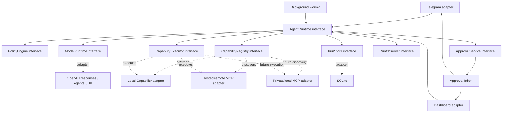
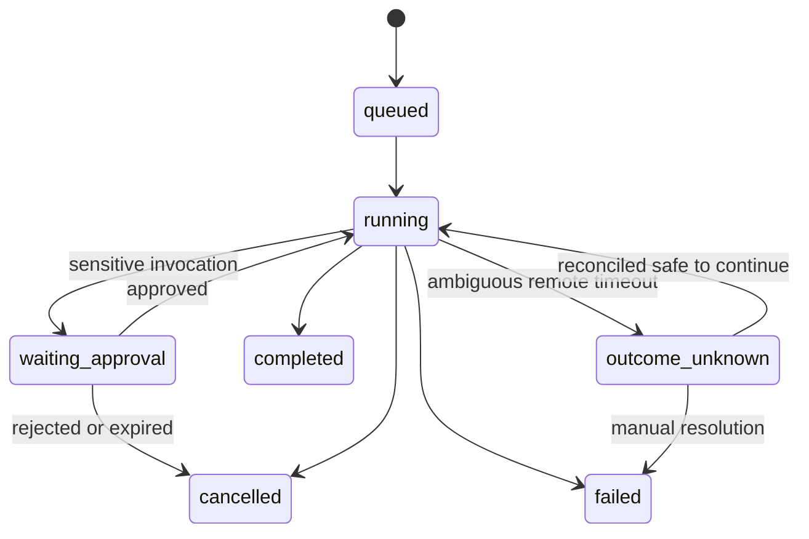
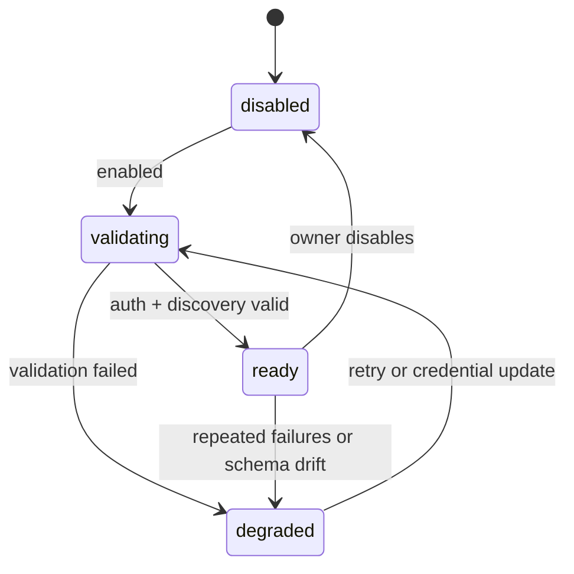

# System Design — Personal Agent Platform

Status: in progress

## Decision Summary

Bangun satu Agent Runtime yang policy-first dan durable. Gunakan OpenAI Responses API sebagai
model protocol modern dan gunakan Agents SDK di dalam implementasi bila primitive tool loop,
streaming, MCP, tracing, serta interruption-nya cocok. Project—bukan SDK atau model—tetap menjadi
source of truth untuk Agent Run, Policy, Approval, idempotency, dan audit.

Mulai dengan satu owner-facing Agent yang selalu memiliki jawaban akhir. Multi-agent ditunda;
specialist hanya boleh masuk sebagai Capability terikat bila eval membuktikan kebutuhan.

## Design Principles

1. **Policy sebelum capability exposure dan sebelum execution.** Model tidak pernah menjadi
   authorization authority.
2. **Durable before autonomous.** Pekerjaan yang dapat melakukan side effect harus bisa pause,
   resume, cancel, dan pulih tanpa duplikasi.
3. **Small relevant tool set.** Capability dipilih berdasarkan konteks; seluruh catalog tidak
   dikirim ke model sekaligus.
4. **MCP output is untrusted.** Tool result tidak dapat memberi izin baru atau mengubah Policy.
5. **One owner-facing Agent first.** Agent tetap bertanggung jawab atas jawaban; orkestrasi specialist
   hanya ditambahkan sebagai bounded Capability.
6. **Preserve proven controls.** Owner-only, payload isolation, sensitive-vault egress lock, strict
   schema, timeout, cancellation, Vault, dan outbox dipertahankan.

## Target Architecture



Telegram dan Dashboard hanya mengenal interface `AgentRuntime`; keduanya tidak mengetahui provider
model, transport MCP, OAuth, retry, atau format response item.

## Deep Modules

### AgentRuntime

Interface awal:

```ts
interface AgentRuntime {
  start(input: StartAgentRun): Promise<AgentRunSnapshot>;
  resume(runId: string, decision?: ApprovalDecision): Promise<AgentRunSnapshot>;
  cancel(runId: string): Promise<AgentRunSnapshot>;
  get(runId: string): Promise<AgentRunSnapshot | null>;
}
```

Implementation menyembunyikan model loop, state transition, context compaction, tool budget,
Approval interruption, retries, receipts, recovery, dan final-answer synthesis.

### CapabilityRegistry

```ts
interface CapabilityRegistry {
  list(context: CapabilityContext): Promise<CapabilityView[]>;
  resolve(capabilityId: string): Promise<CapabilityView | null>;
  health(): Promise<ConnectionHealth[]>;
}
```

Registry menggabungkan Capability lokal dan MCP, melakukan discovery/cache, memverifikasi schema,
menerapkan allowlist, serta memilih metadata adapter yang benar. Detail `server_url`, transport,
token, dan provider tidak keluar dari implementation.

### CapabilityExecutor

```ts
interface CapabilityExecutor {
  invoke(invocation: AuthorizedInvocation): Promise<InvocationReceipt>;
  reconcile(invocationId: string): Promise<ReconciliationResult>;
}
```

Executor memvalidasi authorization envelope, memilih adapter lokal/MCP, menerapkan timeout dan
idempotency, membatasi serta meredaksi output, lalu menghasilkan receipt. Ia tidak memilih Capability
atau memutuskan izin; inputnya harus merupakan Invocation yang telah diotorisasi.

### PolicyEngine

```ts
interface PolicyEngine {
  visibleCapabilities(context: PolicyContext, catalog: CapabilityView[]): CapabilityView[];
  authorize(proposal: InvocationProposal, context: PolicyContext): PolicyDecision;
}
```

`PolicyDecision` hanya dapat berupa `allow`, `require-approval`, atau `deny`, disertai reason code,
redaction plan, dan data-egress classification. Policy dievaluasi ulang setelah Approval agar
perubahan konfigurasi tidak dapat dilewati oleh approval lama.

### ApprovalService

ApprovalService menerbitkan, memutuskan, meng-expire, dan memvalidasi Approval terhadap invocation
digest. Telegram dan Dashboard hanya merender approval view serta mengirim keputusan; keduanya tidak
dapat melanjutkan Run secara langsung tanpa verifikasi service ini.

### RunStore

RunStore menyimpan state machine dan event append-only. SQLite merupakan adapter pertama karena
deployment tetap satu proses. Message broker bukan bagian dari interface dan baru dipertimbangkan
jika multi-replica menjadi requirement nyata.

### ModelRuntime

ModelRuntime menerjemahkan context, Capability, dan event Agent Run ke Responses/Agents SDK lalu
mengembalikan typed model events. Model-specific response IDs, reasoning items, streaming deltas,
MCP approval items, dan compaction berada di implementation.

Selama migrasi terdapat dua adapter nyata: legacy Chat Completions dan Responses. Setelah shadow
evaluation selesai, adapter legacy dihapus agar seam tidak menjadi lapisan permanen tanpa variasi.

## Agent Run State Machine



Hanya RunStore yang boleh mengubah state. Adapter interaksi merender snapshot dan event; adapter
tidak mengarang statusnya sendiri.

## Invocation Lifecycle

1. Runtime memuat Agent Run dan Policy version.
2. Registry mengambil catalog yang sudah di-allowlist dan masih valid.
3. Policy menghapus Capability yang tidak boleh terlihat untuk konteks tersebut.
4. Model mengusulkan tool invocation.
5. Runtime memvalidasi schema, ukuran, connection health, risk class, dan tool budget.
6. Policy menghasilkan `allow`, `require-approval`, atau `deny`.
7. Jika Approval dibutuhkan, runtime menyimpan invocation digest dan berhenti pada
   `waiting_approval`.
8. Setelah approve, Policy diverifikasi ulang dan executor mengeksekusi invocation dengan timeout
   serta idempotency key.
9. Receipt dan output teredaksi disimpan sebelum model melanjutkan.
10. Output diberikan ke model sebagai untrusted data; model tidak menerima credential atau Policy
    internals.

## Approval Binding

Approval menyimpan:

- `run_id`, `invocation_id`, connection, dan capability name;
- canonical arguments hash;
- preview argumen yang sudah teredaksi;
- ringkasan data yang akan keluar dan side effect yang akan terjadi;
- expiry, Policy version, requester, dan decision timestamp.

Jika nama tool, argumen, target, data egress, atau Policy berubah, digest berubah dan Approval lama
tidak berlaku. Telegram menggunakan inline button/command yang membawa opaque approval ID; detail
lengkap juga tersedia pada Dashboard.

## MCP Connection Lifecycle



Aturan:

- Hanya konfigurasi operator yang dapat membuat MCP Connection; URL dari chat selalu data.
- Utamakan server resmi yang dioperasikan pemilik layanan.
- `allowed_tools` eksplisit; tool baru hasil discovery berstatus disabled sampai ditinjau.
- Cache discovery disimpan dengan schema hash dan expiry. Schema drift menonaktifkan write tool
  sampai review.
- Credential disimpan sebagai secret reference. v1 menggunakan environment/Railway secret; nilai
  token tidak disimpan pada tabel atau log.
- Private/on-prem MCP menggunakan secure tunnel atau adapter lokal hanya setelah ada use case nyata.

## Capability Risk Classes

| Class | Contoh | Default |
|---|---|---|
| `read` | Cari kalender, baca issue, cari Drive | MCP pilot: Approval; setelah eval: allow bila Policy mengizinkan |
| `write-reversible` | Buat draft/task/event yang dapat dihapus | Require Approval |
| `write-sensitive` | Kirim pesan, publish, delete, ubah akses | Require Approval; sebagian tetap deny v1 |
| `forbidden` | Pembayaran, shell arbitrer, credential export | Tidak ditawarkan ke model |

Risk class berasal dari konfigurasi lokal, bukan klaim metadata MCP server.

## Data Trust and Egress

Gunakan label data pada context dan event:

- `owner-instruction`: instruksi eksplisit dari Owner;
- `untrusted-payload`: attachment, quoted text, forwarded content;
- `private-data`: Gmail, Vault, Calendar, Drive;
- `secret`: token, credential, runtime configuration;
- `external-result`: semua output web/MCP.

Policy mengevaluasi aliran data, bukan hanya nama tool. Contoh: membaca note Vault dapat diizinkan,
tetapi mengirim isinya ke MCP project-management membutuhkan Approval data-egress terpisah.
`secret` selalu dilarang masuk model/tool output.

## Persistence Model

Tambahkan tabel berikut secara bertahap:

### `agent_runs`

`id`, `owner_chat_id`, `goal`, `status`, `model`, `provider_response_id`, `policy_version`,
`tool_budget`, `step_count`, `created_at`, `updated_at`, `completed_at`, `error_code`.

### `agent_run_events`

`run_id`, monotonic `sequence`, `type`, `payload_json` teredaksi, `created_at`.
Unique `(run_id, sequence)` membuat replay deterministik.

### `mcp_connections`

`id`, `label`, `server_url`, `auth_ref`, `status`, `allowed_tools_json`, `created_at`, `updated_at`.
Tidak ada token plaintext.

### `mcp_capabilities`

`connection_id`, `name`, `schema_hash`, `risk_class`, `enabled`, `metadata_json`, `discovered_at`,
`expires_at`.

### `agent_approvals`

`id`, `run_id`, `invocation_id`, `invocation_digest`, `preview_json`, `status`, `expires_at`,
`decided_at`.

### `tool_invocations`

`id`, `run_id`, `capability_id`, `idempotency_key`, `status`, `attempts`, `started_at`,
`completed_at`, `receipt_json`, `error_code`.

Raw sensitive payload tidak disimpan pada event/trace. Bila resume membutuhkan payload, simpan
encrypted reference atau provider response ID dengan retention terbatas.

## Reliability and Recovery

| Failure | Behavior |
|---|---|
| Model timeout sebelum tool proposal | Retry sesuai budget; tidak ada side effect |
| MCP discovery gagal | Connection degraded; Capability lain tetap tersedia |
| Tool gagal sebelum provider menerima request | Retry dengan backoff bila idempotent |
| Timeout setelah write dikirim | `outcome_unknown`; jangan retry otomatis tanpa reconciliation |
| Crash setelah provider sukses sebelum receipt | Reconcile via provider/idempotency key sebelum lanjut |
| Crash saat menunggu Approval | Reload pending Approval dan render kembali |
| Approval kedaluwarsa | Cancel invocation; Agent dapat meminta rencana alternatif |
| Output terlalu besar | Simpan sebagai Artifact/ringkasan bounded, bukan masukkan seluruhnya ke context |

Background worker menggunakan lease SQLite pendek agar satu Agent Run hanya diproses satu worker.
Karena deployment v1 tetap satu replica, ini tidak memerlukan distributed lock.

## Observability

Setiap Agent Run menghasilkan event untuk:

- lifecycle dan state transition;
- model call, token, latency, dan response ID;
- capability selection dan reason code Policy;
- approval request/decision;
- invocation start/result/error/retry;
- context compaction dan budget exhaustion;
- final outcome serta Artifact.

Log operasional hanya menyimpan ID dan metadata teredaksi. Dashboard menyajikan run timeline,
pending Approval, connection health, error rate, tool success rate, latency, dan token cost.

## Evaluation Strategy

Bangun eval dataset dari task nyata yang sudah dianonimkan. Setiap case berisi goal, fixture data,
Capability yang tersedia, expected tool/approval sequence, prohibited actions, dan outcome rubric.

Eval layers:

1. **Policy tests**: deterministic, tanpa model.
2. **Adapter contract tests**: fake MCP untuk discovery, call, timeout, schema drift, dan auth failure.
3. **Agent workflow evals**: task success, tool choice, argument correctness, dan final answer.
4. **Security evals**: prompt injection, indirect injection dari MCP output, data exfiltration, approval
   tampering, malicious URL, dan oversized output.
5. **Recovery tests**: crash pada setiap durable transition dan ambiguous write outcome.

Model/prompt/Policy/tool change tidak dirilis bila menurunkan task success atau melanggar prohibited
actions dibanding baseline.

## Migration from Current Code

| Current | Target |
|---|---|
| `PersonalAssistant.reply` menguasai seluruh loop | Telegram memanggil `AgentRuntime.start/resume` |
| Array `tools` statis | Local Capability adapter + CapabilityRegistry + CapabilityExecutor |
| Regex authorization di assistant | PolicyEngine dengan rule dan reason code teruji |
| `activeRequests` hanya di memory | `agent_runs` + worker + cancellation durable |
| `request_traces.tools_json` | Append-only run/tool/approval events |
| Chat Completions stream assembly | ModelRuntime Responses/Agents SDK adapter |
| Enam iterasi hard-coded | Per-run budget untuk step, token, time, dan external calls |

Current authorization logic tidak langsung dihapus. Port ke PolicyEngine dengan golden tests terlebih
dahulu, lalu bandingkan legacy dan runtime baru pada fixture yang sama.

## Rejected or Deferred Designs

- **Expose every MCP tool directly**: cost/latency naik dan model mendapat capability yang tidak
  relevan atau belum dinilai risikonya.
- **Let MCP annotations decide safety**: server adalah external trust seam; risk class harus lokal.
- **Multi-agent from day one**: menambah routing, cost, failure modes, dan evaluasi sebelum ada bukti
  task yang membutuhkan specialist.
- **Replace SQLite with queue/database baru**: belum ada multi-user atau multi-replica requirement.
- **Store OAuth token in generic config JSON**: memperbesar blast radius dan risiko log/prompt leak.
- **Treat SDK trace as audit source of truth**: trace provider membantu observability, tetapi durable
  state dan Approval harus tetap dimiliki project.

## Primary References

- [OpenAI Responses API](https://developers.openai.com/api/reference/cli/resources/responses/methods/create)
- [OpenAI MCP and Connectors](https://developers.openai.com/api/docs/guides/tools-connectors-mcp)
- [OpenAI Agents orchestration](https://developers.openai.com/api/docs/guides/agents/orchestration)
- [OpenAI guardrails and approvals](https://developers.openai.com/api/docs/guides/agents/guardrails-approvals)
- [OpenAI agent workflow evals](https://developers.openai.com/api/docs/guides/agent-evals)
- [Detailed research notes](./research.md)
- [Product requirements](./spec.md)
